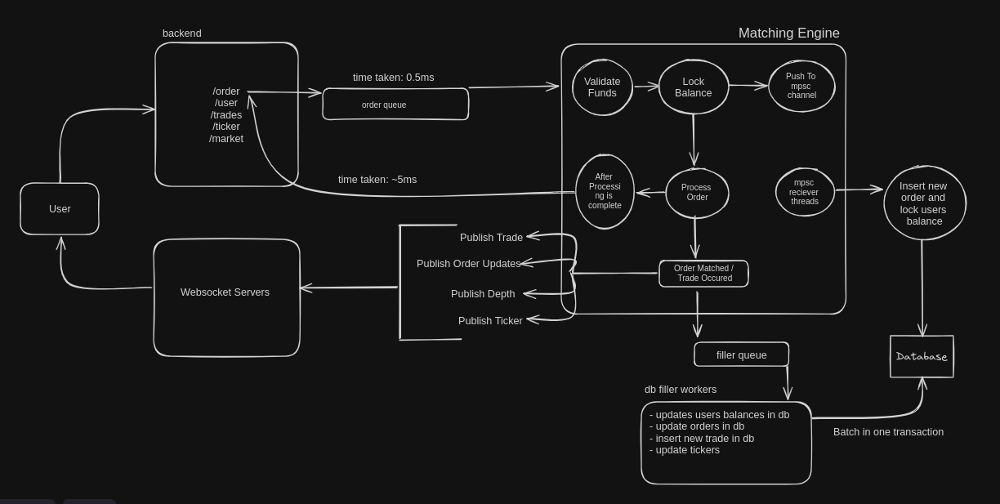
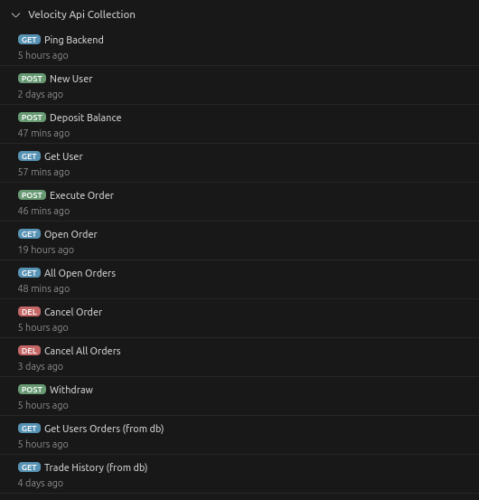

## Key Features
## Performance Benchmarks
- **Order Placement:** <1ms
- **Processing Order & Publishing Events:** ~4ms (1-10ms)
- **Recieving Order Response** ~6ms-10ms
- **Persiting Orderbook Mutations Parallely:** ~10ms (5-40ms)
- **Database Updates:** ~25-40ms per trade (updating orders, updating balances, and inserting trades)

## Architecture
### Database
- **Scylla DB:** Velocity uses Scylla DB for low-latency database interactions, recovering orderbooks ensuring things never go wrong.
### In-Memory Storage
- **Orderbooks and User Balances:** The orderbooks for registered markets and user balances are stored directly in the engine's memory. This allows for quick access and updates.
- **Recovery Mechanism:** 
    - After validating the order and locking the in-memory user balance, the order is pushed into an MPSC channel, and continues processing the order and preparing the response. 
    - Another thread picks from the channel to insert the order and lock the user's balances in the database. 
    - If the engine goes down, ScyllaDB helps recovering the orderbook by replaying orders from the last 24 hours. User data is also reloaded from the database.
### Order Processing
- **Order Placement:** Orders are queued for the matching engine in under 1 millisecond. Each market has its own dedicated thread, allowing parallel handling of orders of different markets.
- **Order Validation & Parallel Storage:** 
    - Limit Orders and Market Orders are validated separately, on failure response is send back to user.
    - On sucess, users balances are locked & orders are transmitted into an another thread via a MPSC channel. 
    - This thread handles db entries and locks user balances inside our Scylla DB.
    - Its does some other things to also persist cancel orders to also sequentially executed when recovering orderbook.
- **Order Execution** The bids and asks orders are structured and executed in following manner:
    - Both of them are a hashmap of price and a limit struct, the limit struct contains all the orders for that specific price limit.
    - Orders are tried to filled by iterating through all the orders from best limit hashmap to worst.
    - When iterating through limit hashmap, and the limit price of that particular hashmap is cut up for the limit order. Processing of order is completed.
    - If any remaining quantity is left, then it is stored inside the orderbook, for new orders to fill them.
    - For every trade that occurs, it's data is transmitted to an event emitter thread of the market via an another MPSC channel which emits relevant pub sub events and queues parallely.
    - After order has been processed fully, finally we send back the response to user via redis lists.
### Trade Matching
- **Balance Updates:** When an order is matched, the system exchanges traders' balances. Then the trades, ticker & depth and order updates are published and database is filled via a filler queue.
- **Database and Broadcasting:** The queue helps fill our database for long-term storage. We use WebSockets and pub/sub mechanisms to broadcast trades, tickers, and depth updates to subscribers and stream private order updates to the order maker from the matching engine directly before the queue.

(this is only a high-to-medium level architecture)

## Videos
- **Architecture**  

https://github.com/me-imfhd/velocity/assets/114667178/6fb65dba-0aee-4536-af0c-2b5a1b5d2094

- **Performance Benchmarks**
  
https://github.com/me-imfhd/velocity/assets/114667178/976cf18e-29c4-47c6-aee2-12e6ac512e58

## Order Request Types:
- **Limit/Market** 
    - Market order are completely filled, lead by quote requests first, & is not stored. 
    - Completely filled limit orders are removed from orderbook.
- **Cancel/CancelAll** 
    - Cancelled orders are removed from orderbook.
- **OpenOrder/OpenOrders**
    - Consists of only partially filled limit orders.

## Api Collection

- **Check assets/api_collection.json for more**

## Remaining:
- Authentication
- Trading View
- Frontend Integration
